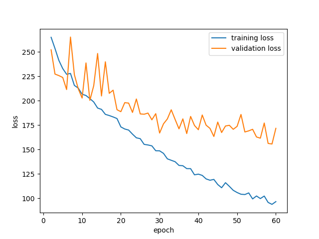
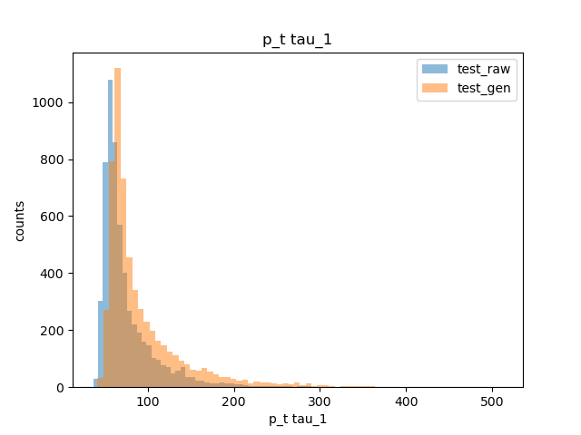
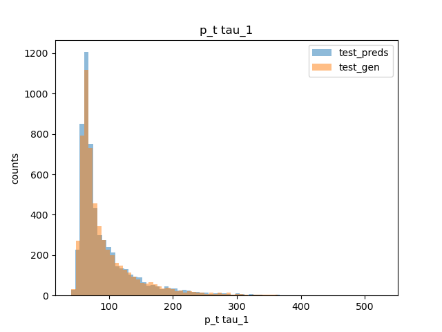
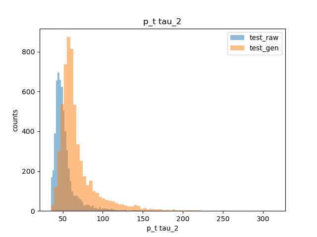
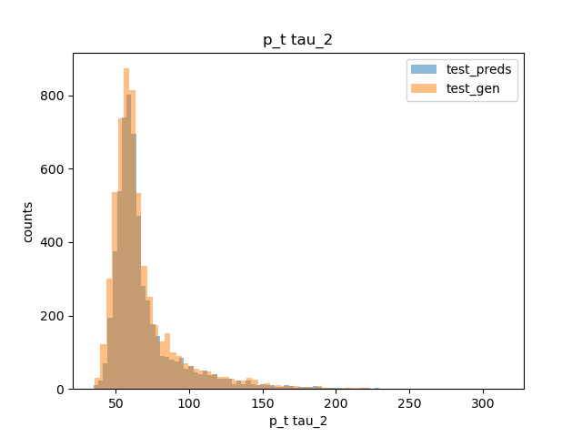

# First neural network model

This folder contains the first machine learning model I trained for the Higgs → ττ dataset.  
The purpose of this model was mainly exploratory: to check how a standard feed-forward neural network architecture performs on this problem, before moving on to transformer-based architectures. The NN code can be found in `nn_code/`.

## Model description

- Framework: PyTorch  
- Task: Predict the true (generated) tau momenta from reconstructed features.  
- Inputs (`X`): 15 features, including:  
  - Tau momenta in Cartesian coordinates (`px_tau`, `py_tau`, `pz_tau`)  
  - Tau energy (`energy_tau`)  
  - Missing transverse energy components (`px_met`, `py_met`, `pz_met`)  
  - Tau angular variables (`phi_tau`, `eta_tau`)  

- Outputs (`y`): 6 target features  
  - Generated tau momenta (`px_gentau`, `py_gentau`, `pz_gentau` for both taus)

- Network architecture:  
  - 5 fully connected layers (200 neurons each)  
  - ReLU activations  
  - Mean Squared Error (MSE) loss  
  - Optimizer: Adam, learning rate = 0.0005  
  - Batch size = 32  
  - Epochs = 60  

## Results

### Learning Curve

### Tau 1 transverse momentum
- Raw reconstructed vs. generated (true):  
    
- Predicted vs. generated (true):  
    

### Tau 2 transverse momentum
- Raw reconstructed vs. generated (true):  
   
- Predicted vs. generated (true):  
     

These results showed that the network could learn useful corrections to the raw reconstructed quantities, but performance was limited compared to more advanced models.

## Comparison with other models

| NN model from my supervisor (6 layers): | My transformer_v3 model: |
|---|---|
|  |  | 

The transformer model clearly outperforms the neural network baseline, especially in reproducing the correct CP-sensitive distribution.
