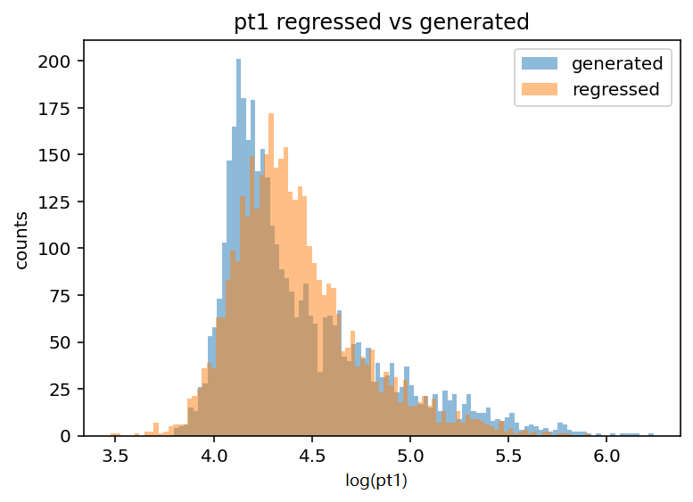
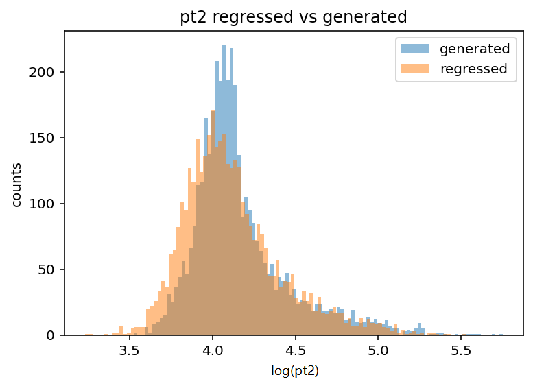
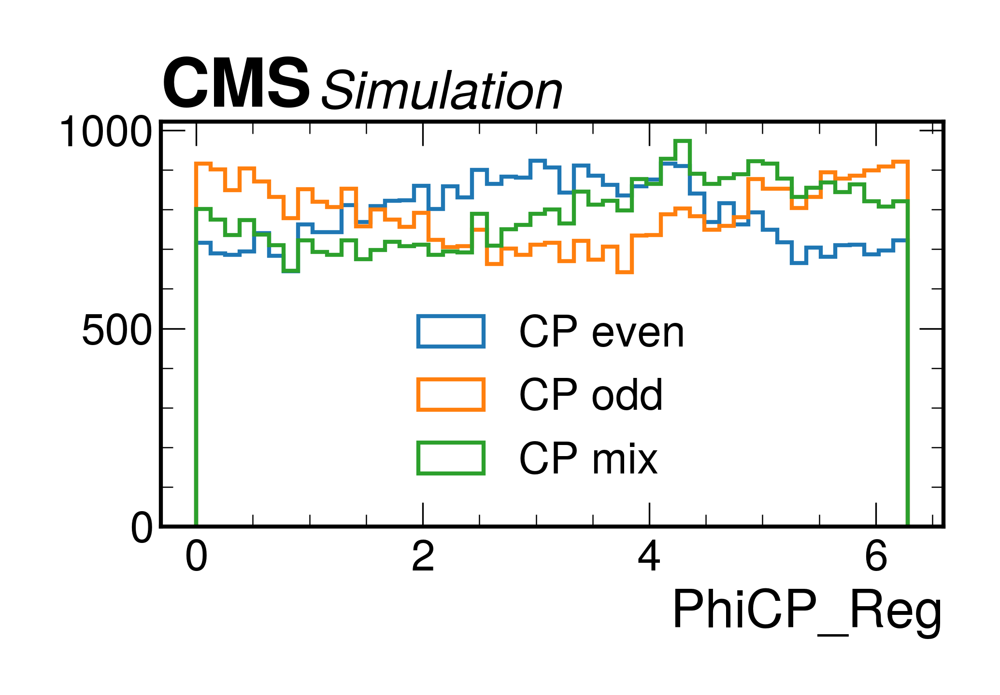

# Transformer v1

This stage of the project introduces a transformer-based model to regress the transverse momenta ($p_T$) of the two taus produced in Higgs decays. The main goal was to test whether a basic transformer architecture could outperform a simple feed-forward neural network in reconstructing missing kinematic information for building CP-sensitive observables.

## Main idea

The model is inspired by the architecture of the Particle Transformer (Qu, H., Li, C., & Qian, S. *Particle Transformer for Jet Tagging*).  
Instead of jet tagging, here the transformer is adapted for momentum regression.  
- Inputs: event-level features describing the reconstructed tau leptons, missing energy (MET), and decay products (pions).  
- Targets: $\log(p_{T1})$ and $\log(p_{T2})$ of the two generated taus.  

## Files

- Results (`transformer_v1_results/`):
  - `pt1_regr_gen.png`, `pt2_regr_gen.png`: regressed vs. generated distributions of $\log(p_{T1})$ and $\log(p_{T2})$.  
  - `phiCP_distr.png`: recovered $\phi_{CP}$ distribution.  
- Regressed values: `pt_regressed.csv`  
- Code (`transformer_v1_code/`):
  - `transformer1.py`: implementation of the v1 transformer model.  

## Model description

1. Input features, arranged into two matrices:
   - Tau candidates: $p_T$, $\phi$, $\eta$ and MET: $p_T$, $\phi$, $\eta$ = 0 ("tau matrix")
   - Pion decay products info for each of the 6 pions (3 from each tau) ("decay matrix")
   - All $p_T$ values are log-transformed
   - There is a mask applied to the tau matrix, for more details refer to *Particle Transformer for Jet Tagging*

2. Target
   - $\log(p_{T1})$ and $\log(p_{T2})$ of the generated taus 

3. Embedding layers
   - Dedicated embeddings for tau candidates and for each pion
   - Additional embedding from interaction masks  

4. Transformer blocks
   - Multi-head self-attention for tau and pion embeddings  
   - Cross-attention module to connect tau-level and decay-level information 

5. Regressor
   - A feed-forward network applied to the concatenated attention outputs (3 hidden layers)   

## Results

### Regressed vs generated $p_T$ 

|  |   |  
|---|---|
MSE for log(pt1): 0.0906 | MSE for log(pt2): 0.0894

### CP-sensitive distribution

The model predictions were used to reconstruct the CP-sensitive acoplanarity angle $\phi_{CP}$.  

The recovered distribution is closer to the reference than the neural network one, but still shows deviations. This indicates that the transformer architecture captures more of the essential features, but improvements are possible.  

|   |  |
|---|---|

## References

- Qu, H., Li, C., & Qian, S. *Particle Transformer for Jet Tagging*.  
- Vaswani, A., Shazeer, N., Parmar, N., Uszkoreit, J., Jones, L., Gomez, A. N., Kaiser, L., & Polosukhin, I. *Attention Is All You Need*.  
