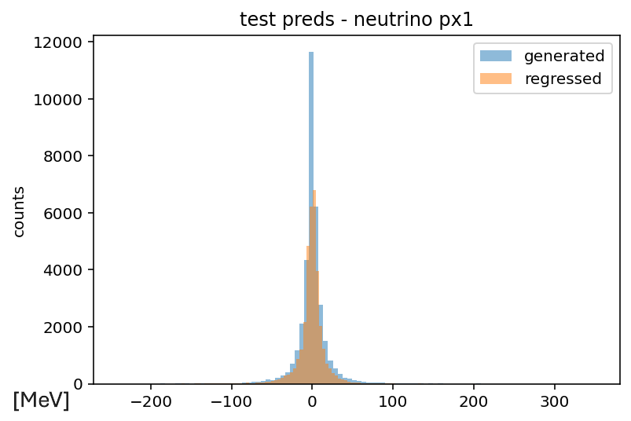
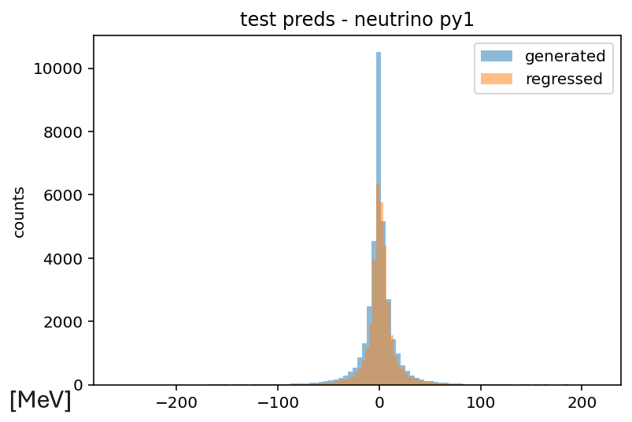
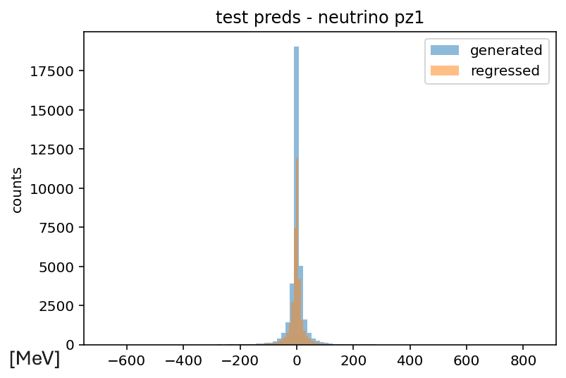
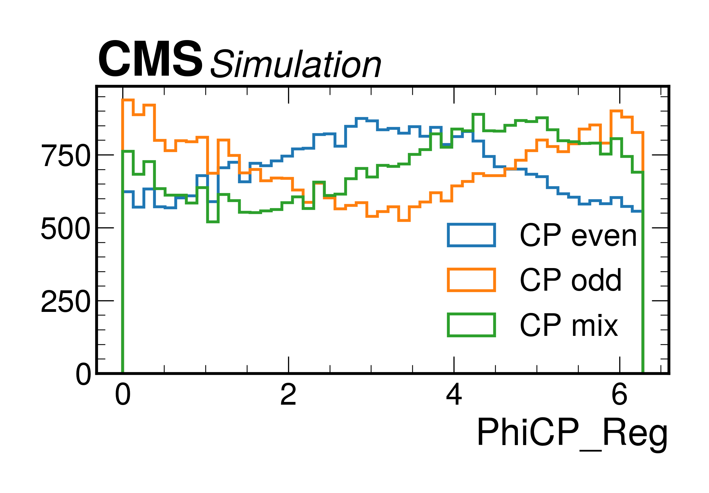

# Transformer v2

This stage builds directly on [Transformer v1](../transformer_v1/transformer_v1.md).  
The general motivation and architecture are described there.  
Here, the focus was on enriching the input information and extending the regression targets to include full neutrino momenta.

## Main changes from v1

- Tau matrix: added primary–secondary vertex (PV–SV) components for each tau.  
- Other matrix: introduced a new matrix with MET + jets (px, py, pz, energy).  
- Decay matrix: extended pion features with energy, charge, and energy fraction.  
- Momentum representation: switched from ($p_T$, $\eta$, $\phi$) to full Cartesian components ($p_x$, $p_y$, $p_z$).  
- Targets: included generated neutrino momenta ($p_x$, $p_y$, $p_z$ for each neutrino).  
  - These were added to the reconstructed tau momenta to recover the full tau 4-momenta.  
  - For CP studies, only $p_x$, $p_y$ were used to recompute $p_T$, assuming directions are correct.  

## Files

- Code (`transformer_v2_code/`):
  - `transformer2.py`: implementation of the v2 model.  
  - `xyz_new_nu_boosted.pth`: saved model weights.  

- Results (`transformer_v2_results/`):
  - `preds_px1.png`, `preds_py1.png`, `preds_pz1.png`: regressed vs generated distributions for selected components  
  - `phiCP_distr.png`: reconstructed CP-sensitive distribution.  
  - `xyz_new_pt_nu_boosted.csv`: regressed transverse momenta ($p_T$).  

## Results

### Regressed vs generated momenta

Below are examples of generated vs regressed distributions for selected momentum components:

|  |  |  |  
|---|---|---|  

Mean Absolute Error (MAE) for the full tau momenta (regressed neutrinos + reconstructed taus):  
- $p_x^1$: **27.37**  
- $p_y^1$: **26.73**  
- $p_z^1$: **47.07**  
- $p_x^2$: **19.77**  
- $p_y^2$: **20.22**  
- $p_z^2$: **37.44**  

### CP-sensitive distribution

The recovered $\phi_{CP}$ distribution was computed using the regressed momenta.  
It shows a slightly better shape than in v1, though still deviates from the expected theoretical curve.  

|  |  |
|---|---|  

