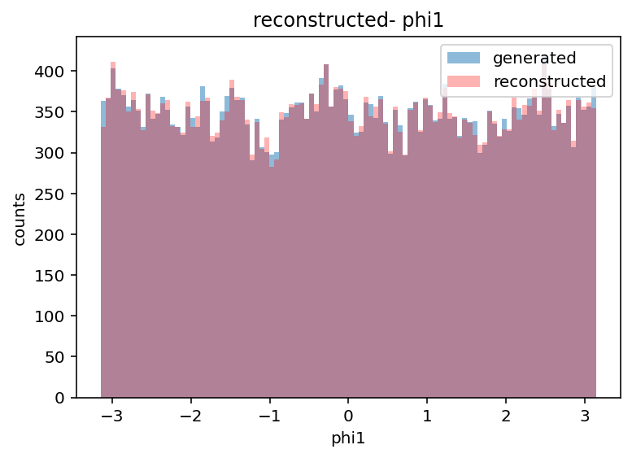

# Transformer v3

This version continues the development from [Transformer v2](../transformer_v2/).  
The general structure and motivation are explained in [Transformer v1](../transformer_v1/).  
Here, the focus is on moving from neutrino-only regression to full tau momenta regression.

## Main changes from v2

- Targets: instead of predicting only neutrino components, the model directly regresses the full tau momenta ($p_x$, $p_y$, $p_z$) of both taus.  
- Observables: the reconstructed $\phi_{CP}$ is now obtained using all momentum components ($p_x$, $p_y$, $p_z$), not just $p_T$.  
- Outputs: the regressed tau momenta are stored in `pt3.csv` files as ($p_T$, $\eta$, $\phi$), converted from the predicted Cartesian components.  

## Files

- Code (`transformer_v3_code/`):  
  - `transformer3.py`: implementation of the v3 transformer model.  
  - `may2.pth`: saved trained model.  

- Results (`transformer_v3_results/`):  
  - `px1_preds.png`, `py2_preds.png`, `pz1_preds.png`: generated vs regressed distributions of tau momentum components.  
  - `pt3.csv`: regressed momenta in ($p_T$, $\eta$, $\phi$).  
  - `phicp_distr.png`: reconstructed $\phi_{CP}$ distribution.  
  - Extras: comparisons of generated vs reconstructed/regressed angular variables:  
    - `eta1_reco.png`, `eta1_regr.png`  
    - `phi1_reco.png`, `phi1_regr.png`  
    These confirm that the tau momentum directions are already well reconstructed, and regressing the full tau momenta does not significantly change $\eta$ and $\phi$.  

## Results

### Regressed vs generated tau momenta

Mean absolute errors (MAE) for the full tau momenta:  

- $p_{x1}$: 13.23  
- $p_{x2}$: 11.09  
- $p_{y1}$: 12.80  
- $p_{y2}$: 10.48  
- $p_{z1}$: 26.24  
- $p_{z2}$: 20.88  
We notice a significant decrease in the MAE compared with the results from v2.

|  |  |  
|---|---|  
|  |   |  

### CP-sensitive distribution

The reconstructed $\phi_{CP}$ distribution is comparable to that obtained with v2. This shows that regressing the full tau momenta is viable and that the assumption in v2 (only regressing neutrinos) was not strictly necessary.  

|  |  |
|---|---|  

### Comparison of reconstructed vs regressed angular variables

To validate the assumption about correct tau directions, we compare reconstructed vs regressed distributions of $\eta$ and $\phi$:  

|  |  |  
|---|---|  
|  |  |  

Both reconstructed and regressed angular variables are close to the generated ones, confirming that the tau directions were already well estimated. We observe nonetheless that the regressed distribution overlaps better with the generated one than the reconstructed distribution.

## Summary

This was the final version developed during the internship. We observe that the recovered $\phi_{CP}$ distribution is of good quality, similarly to v2.  
It is therefore sufficient to regress the full tau momenta instead of only neutrinos.  

There is still room for improvement, but the progress compared to the simple feed-forward network is significant (see [nn.md](../nn/nn.md) for the direct comparison of $\phi_{CP}$ distributions).  
